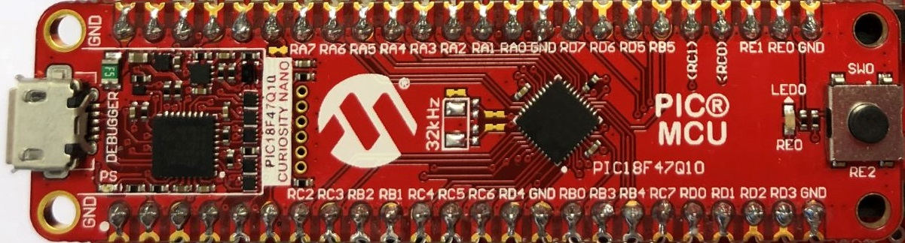

# PIC18F47Q10 Use TMR4 in One-Shot mode with external signal as reset

The PIC18F47Q10 features Three 8-bit Timers/Counters with One-Shot Operation.
In this demo, uses TMR4 peripheral in One-Shot to stop TMR2 if an external pin is pulled to GND for more than a desired period.

## Related Documentation
- [TB3285 - Getting Started with Timers/Counters on PIC18](https://www.microchip.com/wwwappnotes/appnotes.aspx?appnote=en1003329)
- [PIC18F47Q10 Product Family Page](https://www.microchip.com/design-centers/8-bit/pic-mcus/device-selection/PIC18F47Q10)
- [PIC18F47Q10 datasheet](http://ww1.microchip.com/downloads/en/DeviceDoc/40002043D.pdf)

## Software Used

- MPLAB® X IDE 5.30 or newer [(microchip.com/mplab/mplab-x-ide)](http://www.microchip.com/mplab/mplab-x-ide)
- MPLAB® XC8 2.10 or newer compiler [(microchip.com/mplab/compilers)](http://www.microchip.com/mplab/compilers)
- MPLAB® Code Configurator (MCC) 3.95.0 or newer [(microchip.com/mplab/mplab-code-configurator)](https://www.microchip.com/mplab/mplab-code-configurator)
- MPLAB® Code Configurator (MCC) PIC10/PIC12/PIC16/PIC18 library v1.79.0 or newer [(microchip.com/mplab/mplab-code-configurator)](https://www.microchip.com/mplab/mplab-code-configurator)

## Hardware Used
- PIC18F47Q10 Curiosity Nano [(DM182029)](https://www.microchip.com/Developmenttools/ProductDetails/DM182029)

## Setup

- The PIC18F47Q10 Curiosity Nano Development Board [(DM182029)](https://www.microchip.com/Developmenttools/ProductDetails/DM182029) is used as the test platform.
     

The following pin configurations must be made for this project:

|Pin           | Configuration         |
| :----------: | :-------------------: |
|RE0           | Digital output (LED0) |
|RC7           | Digital input as TMR4 trigger |

## Operation
1. Build demo firmware, make and program the generated code onto the PIC18F47Q10 Curiosity Nano.
2. Run the code generated with MCC, LED0 will blink with a rate of `Timer2Period` (100ms).
3. If the external pin RC7 is pulled to GND for more than `Timer4Period` (500ms), then LED0 will stop blinking. 
     

## Summary

This project showcases how easy it is to use the TMR4 of PIC18F47Q10 in One-Shot mode with external signal as reset.
