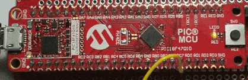

 <article class="markdown-body entry-content p-3 p-md-6" itemprop="text">

# PIC18F47Q10 Use TMR4 in One-Shot mode with external signal as reset

## Objective:
The PIC18F47Q10 features timers with One-Shot Operation.
In this demo, uses TMR4 peripheral in One-Shot to stop TMR2 if an external pin is pulled to GND for more than a desired period.

## Resources:
- Technical Brief Link [(linkTBD)](http://www.microchip.com/)
- MPLAB® X IDE 5.30 or newer [(microchip.com/mplab/mplab-x-ide)](http://www.microchip.com/mplab/mplab-x-ide)
- MPLAB® XC8 2.10 or newer compiler [(microchip.com/mplab/compilers)](http://www.microchip.com/mplab/compilers)
- MPLAB® Code Configurator (MCC) 3.95.0 or newer [(microchip.com/mplab/mplab-code-configurator)](https://www.microchip.com/mplab/mplab-code-configurator)
- PIC18F47Q10 Curiosity Nano [(DM182029)](https://www.microchip.com/Developmenttools/ProductDetails/DM182029)
- Curiosity Nano Base for Click Boards™ [(AC164162)](https://www.microchip.com/Developmenttools/ProductDetails/AC164162)
- POT click board™ [(MIKROE-3402)](https://www.mikroe.com/pot-click)
- [PIC18F47Q10 datasheet](http://ww1.microchip.com/downloads/en/DeviceDoc/40002043D.pdf) for more information or specifications.

## Hardware Configuration:

The PIC18F47Q10 Curiosity Nano Development Board [(DM182029)](https://www.microchip.com/Developmenttools/ProductDetails/DM182029) is used as the test platform.

The following configurations must be made for this project:
- RE0 (LED0) pin - Configured as digital output
- RC7 pin - Configured as digital input

## Demo:
Run the code generated by MCC, LED0 will blink with a rate of `Timer2Period` (100ms) and if the external pin RC7 is pulled down for more than `Timer4Period` (500ms), the LED0 will stop blinking. 

